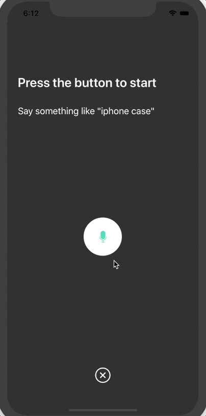

# Voice Overlay iOS

A beautiful customizable voice overlay widget that records the user's voice input.

# Demo


# Installation

#### CocoaPods

`InstantSearchVoiceOverlay` is available through [CocoaPods](http://cocoapods.org). To install
it, simply add the following line to your Podfile:

Swift 4:

```ruby
pod 'InstantSearchVoiceOverlay'
```

### Carthage


[Carthage](https://github.com/Carthage/Carthage) is a simple, decentralized dependency manager for Cocoa.

To install InstantSearch, simply add the following line to your Cartfile:

```ruby
github "algolia/voice-overlay-ios"
```

# Usage

1- In `Info.plist`, add these 2 string properties along with the description

- `Privacy - Microphone Usage Description` with a description like: `Need the mic for audio to text`
- `Privacy - Speech Recognition Usage Description` some description like: `Need the speech recognition capabilities for searching tags`


2- Start the Voice Overlay and listen to the text output

```swift
import InstantSearchVoiceOverlay

class ViewController: UIViewController {
    
    let voiceOverlayController = VoiceOverlayController()
    
    @objc func voiceButtonTapped() {
        
        voiceOverlayController.start(on: self, textHandler: { (text, final) in
            print("voice output: \(String(describing: text))")
            print("voice output: is it final? \(String(describing: final))")
        }) { (error) in
            print("voice output: error \(String(describing: error))")
        }
    }
```

## Customization

You can customize your voice overlay by modifying the `settings` property of the voiceOverlayController:

```swift
` /// Specifies whether the overlay directly starts recording (true), or if it requires the user to click the mic (false).
voiceOverlayController.settings.autoStart = true

/// Specifies whether the overlay stops recording after the user stops talking for `autoStopTimeout` seconds (true), or if it requires the user to click the mic (false).
voiceOverlayController.settings.autoStop = true

/// When autoStop is set to true, autoStopTimeout determines the amount of silence time of the user that causes the recording to stop.
voiceOverlayController.settings.autoStopTimeout = 2

/// Whether or not to show a result screen after the recording is finished.
voiceOverlayController.settings.showResultScreen = false

/// Timeout for showing the result screen in case no resultScreenText is provided on time.
voiceOverlayController.settings.showResultScreenTimeout = 2

/// Time for showing the result screen with the provided resultScreenText.
voiceOverlayController.settings.showResultScreenTime = 4

/// The processed result screen text that should be appear in the result screen.
voiceOverlayController.settings.resultScreenText = NSAttributedString(string: myString, attributes: myAttributes)

/// The layout and style of all screens of the voice overlay.
voiceOverlayController.settings.layout
// Change the title of the recording screen when the recording is ongoing.
voiceOverlayController.settings.layout.recordingScreen.titleListening = "my custom title"
// Change the background color of the permission screen
voiceOverlayController.settings.layout.permissionScreen.backgroundColor = UIColor.red`
```


## Delegate
Optionally, to listen to text and error events, you can conform to the method of the `VoiceOverlayDelegate` protocol.

```swift
// Second way to listen to recording through delegate
func recording(text: String?, final: Bool?, error: Error?) {
    if let error = error {
        print("delegate: error \(error)")
    }
    
    if error == nil {
        print("delegate: text \(text)")
    }
}
```

## How It Handles Errors and No Permissions


When there are missing permissions, the voice overlay will guide the user to the correct section of the settings app.



When there are errors, the voice overlay will detect them and let the user try again.

## Getting Help

- **Need help**? Ask a question to the [Algolia Community](https://discourse.algolia.com/) or on [Stack Overflow](http://stackoverflow.com/questions/tagged/algolia).
- **Found a bug?** You can open a [GitHub issue](https://github.com/algolia/instantsearch-ios-insights).
- **Questions about Algolia?** You can search our [FAQ in our website](https://www.algolia.com/doc/faq/).


## Getting involved

* If you **want to contribute** please feel free to **submit pull requests**.
* If you **have a feature request** please **open an issue**.
* If you use **InstantSearch** in your app, we would love to hear about it! Drop us a line on [discourse](https://discourse.algolia.com/) or [twitter](https://twitter.com/algolia).

## License

InstantSearchVoiceOverlay is available under the MIT license. See the LICENSE file for more info.