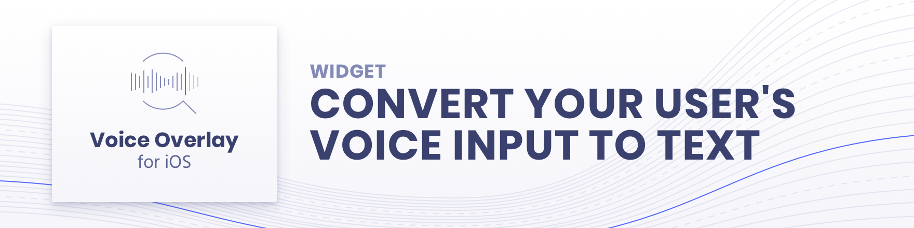
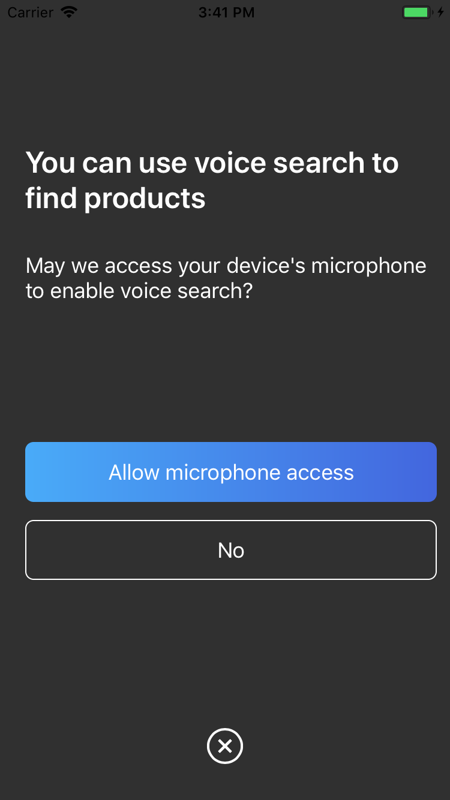
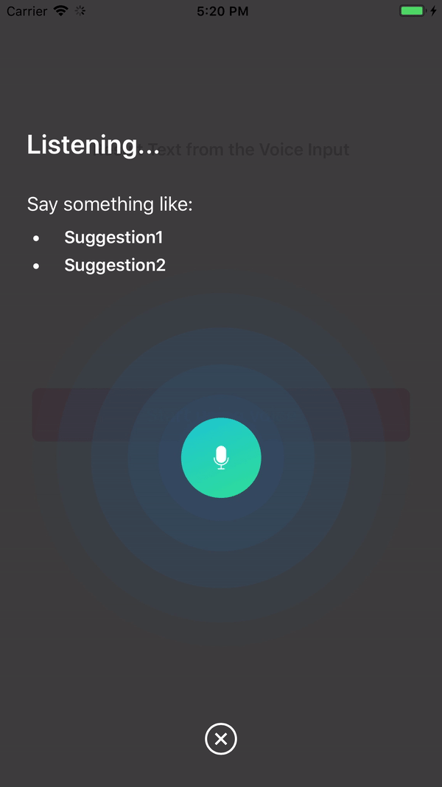
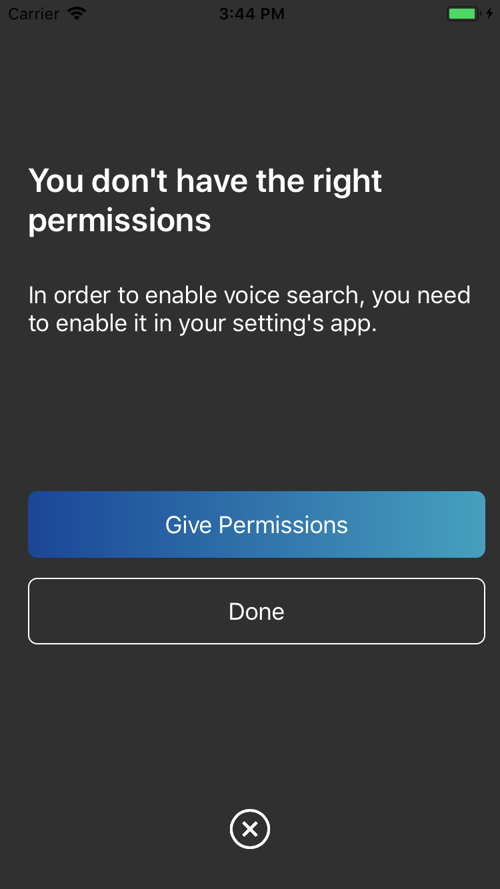
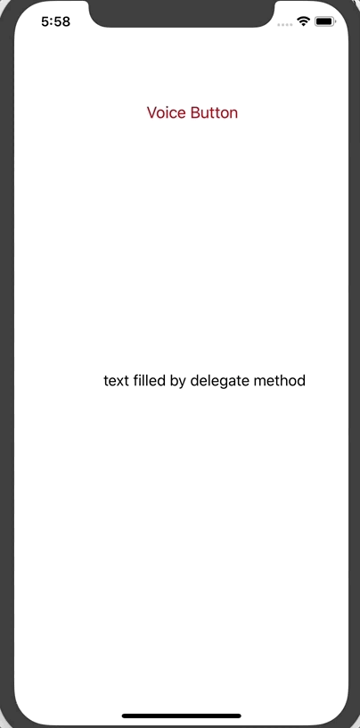
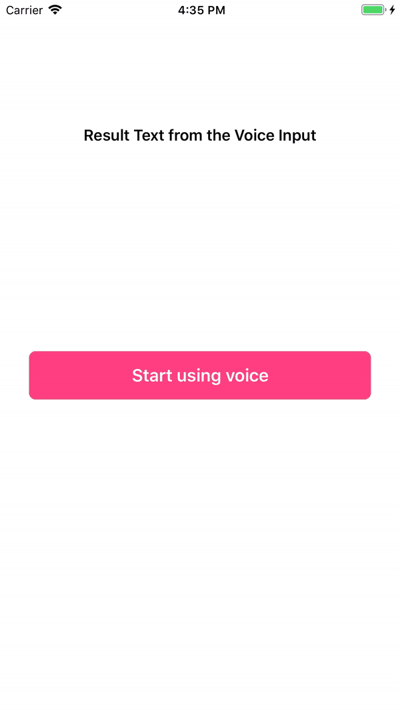
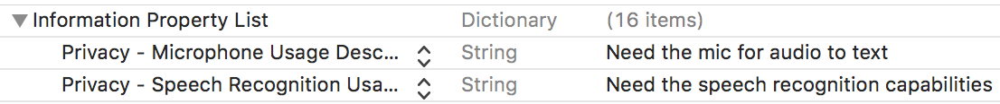
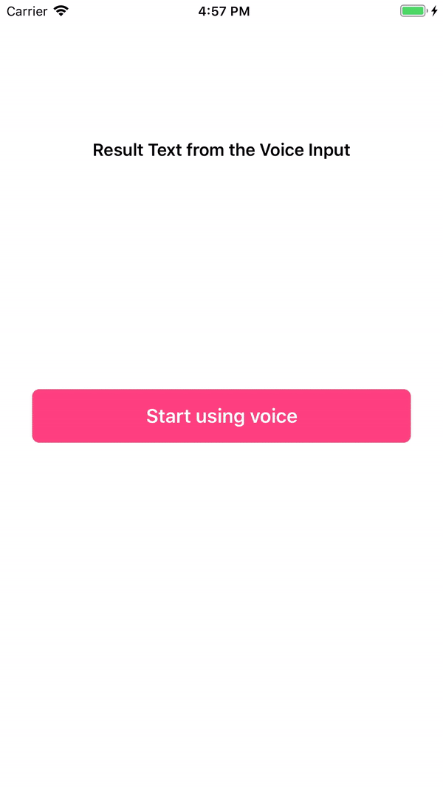
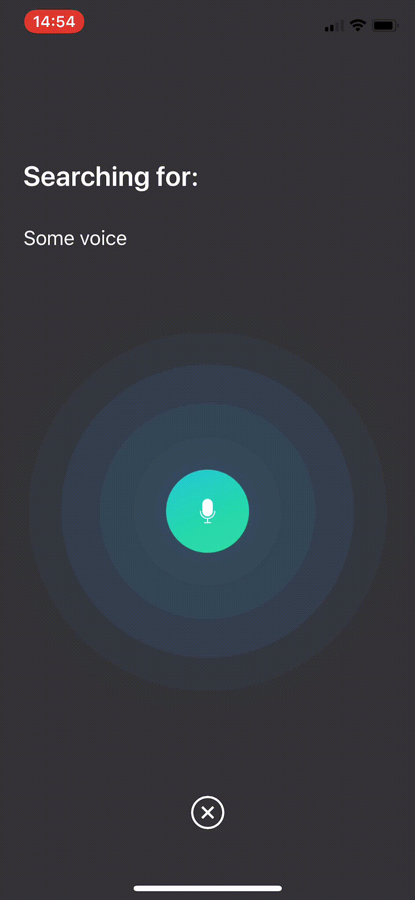

<p align="center">

<a href="https://developer.apple.com/swift"></a>
<a href="https://github.com/Carthage/Carthage"></a>
<a href="https://cocoapods.org/pods/InstantSearchVoiceOverlay"></a>
<a href="LICENSE.md"></a>
</p>

# Overview

**Voice overlay** helps you turn your user's **voice** into **text**, providing a **polished UX** while handling for you the **necessary permissions**.

It uses internally the native `SFSpeechRecognizer` in order to perform the speech to text conversion.

<p float="left">
  
  &nbsp;
  
  &nbsp;
  
  &nbsp;
  
  &nbsp;
</p>

# Demo

You can clone and run the Demo project by doing `pod install` and then running the project

<!--  -->



# Installation

#### CocoaPods

`InstantSearchVoiceOverlay` is available through [CocoaPods](http://cocoapods.org). To install
it, add the following line to your Podfile:

```ruby
pod 'InstantSearchVoiceOverlay', '~> 1.0.0-beta'
```

### Carthage

[Carthage](https://github.com/Carthage/Carthage) is a simple, decentralized dependency manager for Cocoa.

To install InstantSearchVoiceOverlay, add the following line to your Cartfile:

```ruby
github "algolia/voice-overlay-ios" ~> 1.0.0-beta
```

# Usage

1. In `Info.plist`, add these 2 string properties along with the description

- `Privacy - Microphone Usage Description` with a description like: `Need the mic for audio to text`
- `Privacy - Speech Recognition Usage Description` some description like: `Need the speech recognition capabilities for searching tags`



2. Start the Voice Overlay and listen to the text output:

```swift
import InstantSearchVoiceOverlay

class ViewController: UIViewController {
    
    let voiceOverlayController = VoiceOverlayController()
    
    @objc func voiceButtonTapped() {
        
        voiceOverlayController.start(on: self, textHandler: { (text, final) in
            print("voice output: \(String(describing: text))")
            print("voice output: is it final? \(String(describing: final))")
        }, errorHandler: { (error) in
            print("voice output: error \(String(describing: error))")
        })
    }
```

## Customization

You can customize your voice overlay by modifying the `settings` property of the voiceOverlayController:

```swift
/// Specifies whether the overlay directly starts recording (true), 
/// or if it requires the user to click the mic (false). Defaults to true.
voiceOverlayController.settings.autoStart = true

/// Specifies whether the overlay stops recording after the user stops talking for `autoStopTimeout`
/// seconds (true), or if it requires the user to click the mic (false). Defaults to true.
voiceOverlayController.settings.autoStop = true

/// When autoStop is set to true, autoStopTimeout determines the amount of
/// silence time of the user that causes the recording to stop. Defaults to 2.
voiceOverlayController.settings.autoStopTimeout = 2

/// The layout and style of all screens of the voice overlay.
voiceOverlayController.settings.layout.<someScreen>.<someConstant>

// Use XCode autocomplete to see all possible screens and constants that are customisable.
// Examples:

/// The voice suggestions that appear in bullet points
voiceOverlayController.settings.layout.inputScreen.subtitleBulletList = ["Suggestion1", "Sug2"]
/// Change the title of the input screen when the recording is ongoing.
voiceOverlayController.settings.layout.inputScreen.titleListening = "my custom title"
/// Change the background color of the permission screen.
voiceOverlayController.settings.layout.permissionScreen.backgroundColor = UIColor.red
/// And many more...
```

### Changing Locale or SpeechController

You can change locale or SpeechController when initializing your voiceOverlayController like so:

``` swift
lazy var voiceOverlayController: VoiceOverlayController = {
  let recordableHandler = {
    return SpeechController(locale: Locale(identifier: "en_US"))
  }
  return VoiceOverlayController(speechControllerHandler: recordableHandler)
}()
```

You can create your own custom SpeechController class by implementing the `Recordable` protocol.

Note that in Swift 4, you can use `Locale.current.languageCode` to get current locale.

## Delegate
Optionally, to listen to text and error events, you can conform to the method of the `VoiceOverlayDelegate` protocol.

```swift
// Second way to listen to recording through delegate
func recording(text: String?, final: Bool?, error: Error?) {
    if let error = error {
        print("delegate: error \(error)")
    }
    
    if error == nil {
        print("delegate: text \(text)")
    }
}
```

## How it handles when Permissions are missing

When there are missing permissions, the voice overlay will guide the user to the correct section of the settings app.



## Result Screen (Beta)



The result screen appears when `showResultScreen` is set to true.

```swift
/// Whether or not to show a result screen after the recording is finished.
voiceOverlayController.settings.showResultScreen = true

/// Timeout for showing the result screen in case no resultScreenText is provided on time.
voiceOverlayController.settings.showResultScreenTimeout = 2

/// Time for showing the result screen with the provided resultScreenText.
voiceOverlayController.settings.showResultScreenTime = 4

/// The processed result screen text that should be appear in the result screen.
voiceOverlayController.settings.resultScreenText = NSAttributedString(string: myString, attributes: myAttributes)
```
The widget provides a `resultScreenHandler` for when the result screen is dismissed (provided the "Start again" button is not clicked). The handler provides the text that has been set in `resultScreenText` beforehand.

```swift
voiceOverlayController.start(on: self, textHandler: { (text, final) in
    print("getting \(String(describing: text))")
    print("is it final? \(String(describing: final))")

    if final {
        // Process the result to post in the result screen.
        // The timer here simulates a network processing call that took 1.5 seconds.
        Timer.scheduledTimer(withTimeInterval: 1.5, repeats: false, block: { (_) in
            let myString = text
            let myAttribute = [ NSAttributedString.Key.foregroundColor: UIColor.red ]
            let myAttrString = NSAttributedString(string: myString, attributes: myAttribute)

            self.voiceOverlayController.settings.resultScreenText = myAttrString
        })
    }
}, errorHandler: { (error) in
    print("error \(String(describing: error))")
}, resultScreenHandler: { (text) in
    print("Result Screen: \(text)")
})
```

## Getting Help

- **Need help**? Ask a question to the [Algolia Community](https://discourse.algolia.com/) or on [Stack Overflow](http://stackoverflow.com/questions/tagged/algolia).
- **Found a bug?** You can open a [GitHub issue](https://github.com/algolia/instantsearch-ios-insights).
- **Questions about Algolia?** You can search our [FAQ in our website](https://www.algolia.com/doc/faq/).


## Getting involved

* If you **want to contribute** please feel free to **submit pull requests**.
* If you **have a feature request** please **open an issue**.
* If you use **InstantSearch** in your app, we would love to hear about it! Drop us a line on [discourse](https://discourse.algolia.com/) or [twitter](https://twitter.com/algolia).

## License

InstantSearchVoiceOverlay is available under the MIT license. See the [LICENSE file](./LICENSE.md) for more info.
